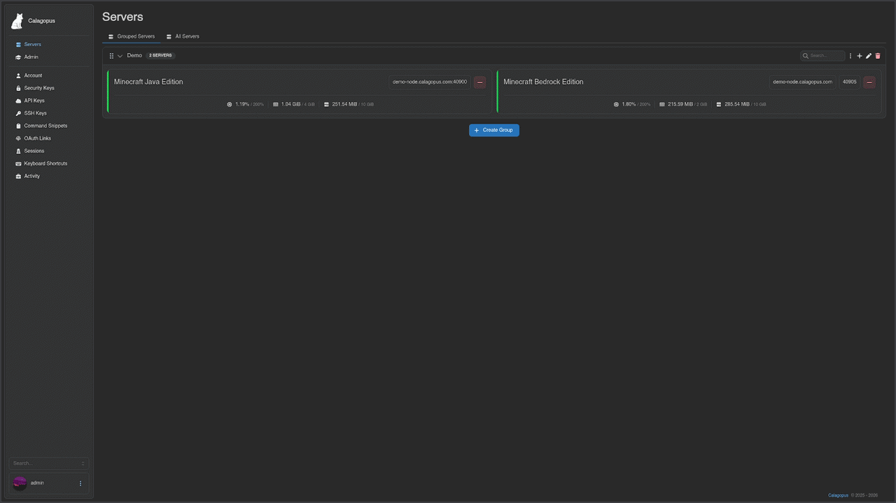

# Calagopus Panel

**A modern game server management panel, rebuilt from the ground up in Rust.**

Calagopus is a ground-up reimplementation of [Pterodactyl Panel](https://github.com/pterodactyl/panel) in Rust. It keeps what made the original great - secure, container-based game server management - while aiming for better performance, a refreshed UI, more features, and a cleaner extension model on both the frontend and backend. If you already run Pterodactyl or Pelican, there is a supported migration path.

## Features

- **Rust backend** - a fast, efficient backend built on Tokio and Axum.
- **Modern frontend** - React, Mantine, and Tailwind for a clean, responsive UI.
- **Extensible by design** - first-class extension systems for backend and frontend, no hacky patches or overrides, real plugin APIs.
- **Egg compatible** - reuses Pterodactyl-style eggs, including a Rust port of Laravel's validation rules.
- **Migration friendly** - import your existing setup from [Pterodactyl](https://calagopus.com/docs/advanced/migrating/pterodactyl) or [Pelican](https://calagopus.com/docs/advanced/migrating/pelican).

## Installation

Full instructions live in the [documentation](https://calagopus.com/docs/panel/installation).

## Roadmap

Tracked publicly here:

- [Frontend](https://notes.rjns.dev/workspace/cb7ccae8-0508-4f90-9161-d1e69b0ca8f0/oXJcC5ei3IQhEf1RFCh6K)
- [Backend](https://notes.rjns.dev/workspace/cb7ccae8-0508-4f90-9161-d1e69b0ca8f0/xfvzMIFHkFSMnOfO_WUEO)

## Project Structure

Repository layout

- [**`frontend/`**](./frontend/) - The frontend of the panel, built with React, Mantine, and Tailwind.
  - [**`extensions/*`**](./frontend/extensions/) - Frontend extensions, such as themes and plugins.
- [**`backend/`**](./backend/) - The backend of the panel, built with Rust and Axum.
- [**`backend-extensions/*`**](./backend-extensions/) - Backend extensions, such as auth providers and database drivers.
- [**`database/`**](./database/) - Database migrations using Drizzle.
- [**`database-migrator/`**](./database-migrator/) - A tool to run database migrations, built with Rust and SQLx.
- [**`shared/`**](./shared/) - Shared code between backend parts, mainly relevant for extensions.
- [**`wings-api/`**](./wings-api/) - An auto-generated API client for the Wings API, built with Rust.
  - [**`generator-src/`**](./wings-api/generator-src/) - The source for the API generator, written in TypeScript.
- [**`rule-validator/`**](./rule-validator/) - A semi-port of Laravel's validation rules in Rust for use with eggs.
- [**`schema-extension/`**](./schema-extension/)
  - [**`core/`**](./schema-extension/core/) - Core library for the schema extension system.
  - [**`derive/`**](./schema-extension/derive/) - A proc macro to derive schema extensions.

## Contributing

Contributions are welcome. Open an issue to discuss larger changes first, and check the [Discord](https://discord.gg/uSM8tvTxBV) if you want to chat through an idea before writing code.

## Acknowledgments

Calagopus builds on the ideas and ecosystem of [Pterodactyl](https://github.com/pterodactyl/panel) and [Pelican](https://github.com/pelican-dev/panel). Thanks to those projects and their communities.

## License

See [LICENSE](https://github.com/calagopus/panel/blob/main/LICENSE).

## Star History

